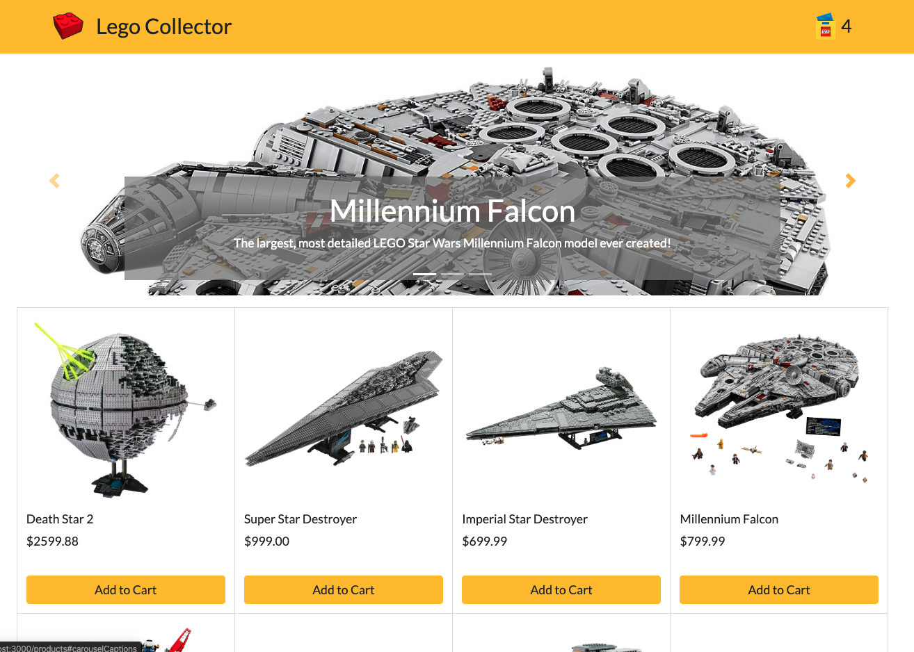

# lego-collector

A full stack LAMP & React shopping cart app.

## Technologies Used

- React.js
- Webpack 4
- Bootstrap 4
- PHP
- MySQL
- HTML5
- CSS3
- AWS EC2

## Live Demo

Try the application live at [https://lego-collector.mrjamesjcho.com](https://lego-collector.mrjamesjcho.com)

## Features

- User can browse Lego products.
- User can click on a product to view product details.
- User can add products to shopping cart.
- User can edit shopping cart.
- User can checkout.

## Preview



## Development

#### System Requirements

- Node.js 10 or higher
- NPM 6 or higher
- MySQL 14 or higher

#### Getting Started

1. Clone the repository.

    ```shell
    git clone https://github.com/mrjamesjcho/lego-collector.git
    cd lego-collector
    ```

1. Install all dependencies with NPM.

    ```shell
    npm install
    ```

1. Import the example database to MySQL.

    ```shell

    ```

1. Start the project. Once started you can view the application by opening http://localhost:3000 in your browser.

    ```shell
    npm run dev
    ```
